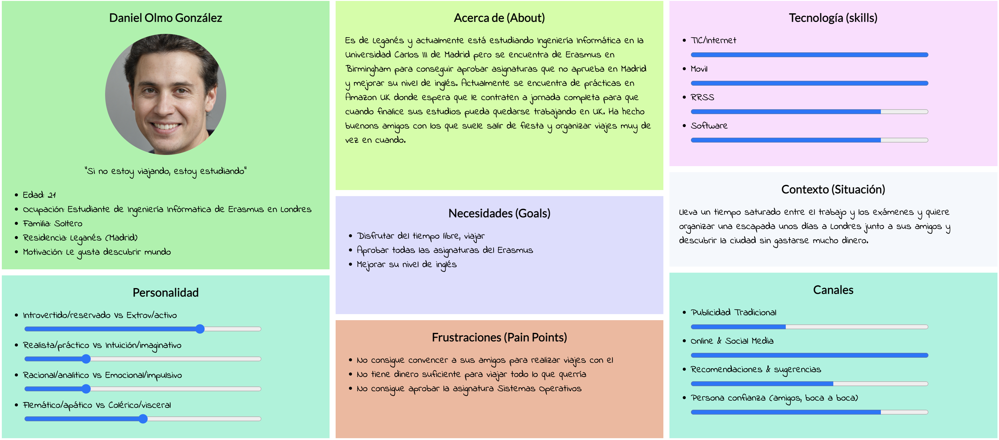
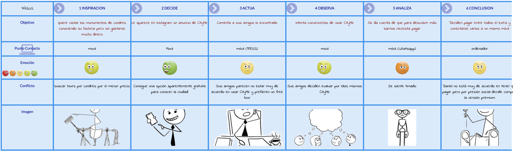
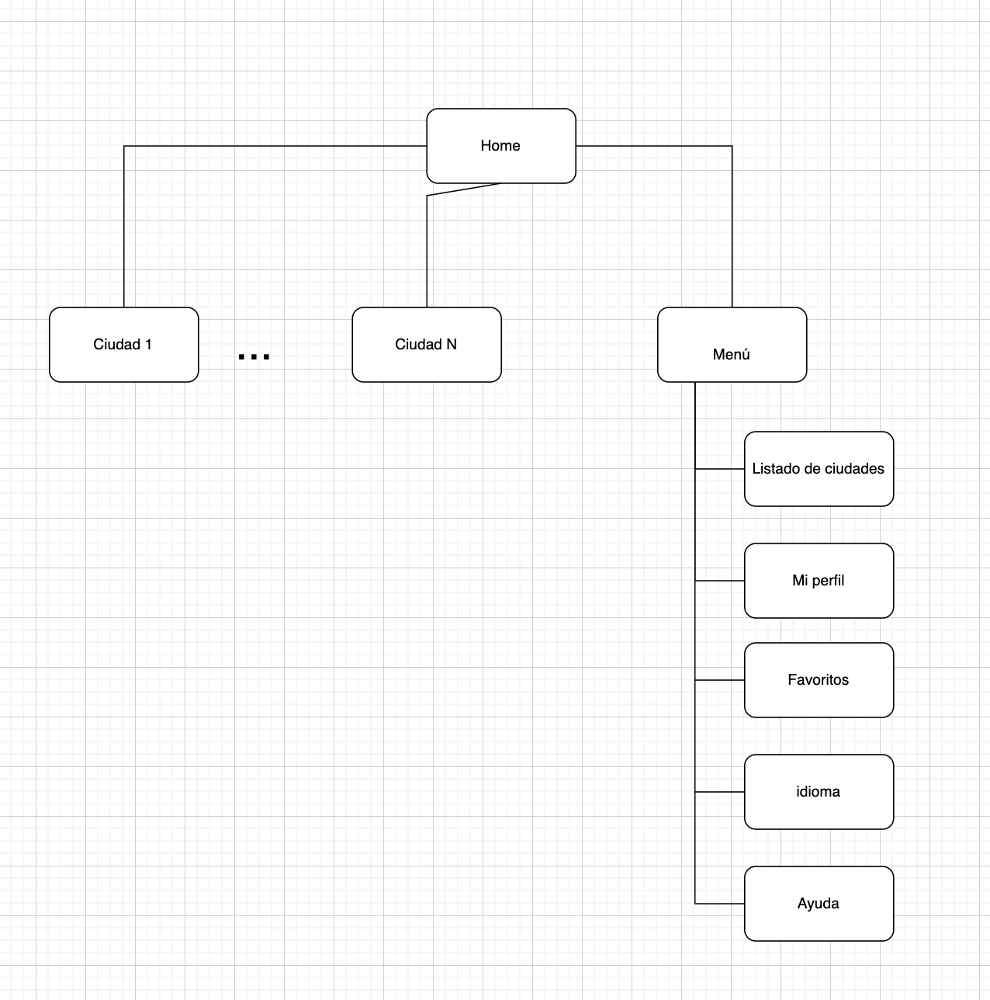
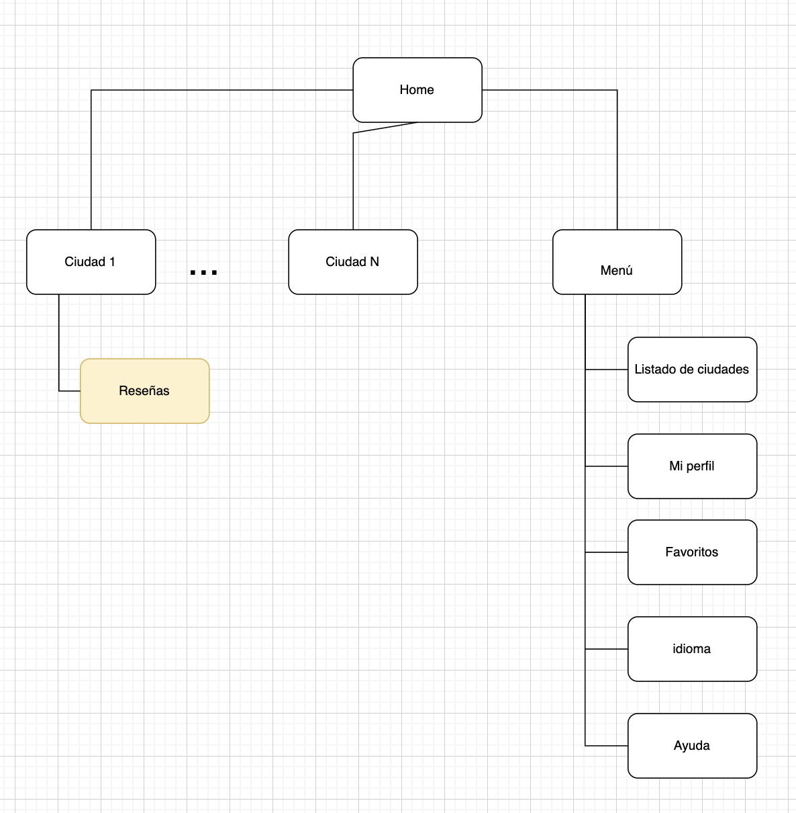
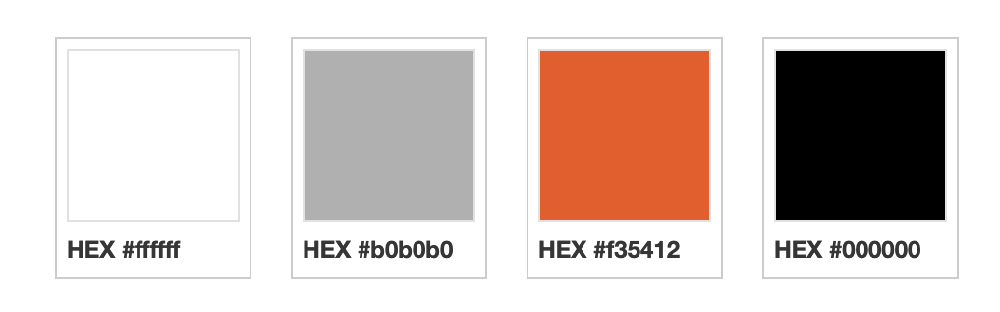
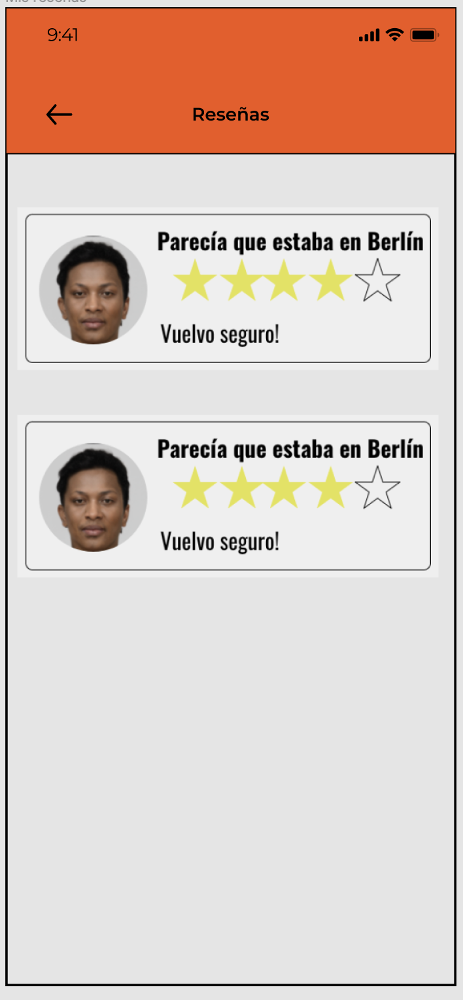
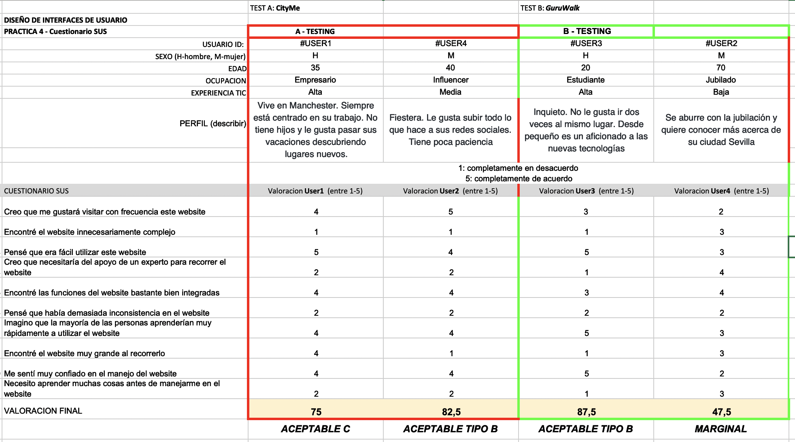

# **CASE STUDY: APP TOUR CIUDAD VS FREE TOUR APP**

Ejercicio final de Diseño de Interfaces de Usuario de la Universidad de Granada (UGR) donde se hará una nueva iteración de diseño tras analizar la propuesta de valor a aplicaciones estilo free tour como es CityMe

## **0. Contexto**
Durante los últimos años (pre-Covid) y podemos seguir viéndolo ahora (post-Covid) muchas personas cuando viajan han utilizado lo denominado free tour. Los "free tour" son recorridos por las ciudades donde nos encontramos, donde un guía turístico ofrece sus servicios de forma 'gratuita'. Especifico 'gratuita' ya que lo normal es que se suela deja mínimo 10€ de propina por el servicio prestado. Estos free tours los podemos encontrar por las ciudades en los puntos más frecuentados por los turistas, pero también existen webapps como [GuruWalk](https://www.guruwalk.com/es) que permite reservar dichos free tours y ver el recorrido que realizan así como las experiencias de otros usuarios. Pero hay propuestas que van más allá.  [CityMe](https://cityme.eu/) ofrece una nueva alternativa a estos free tours en algo que podríamos denominar free tours virtuales. Para ello, basta con descargarse su aplicación donde podremos seleccionar la ciudad que queramos y el barrio del que queramos saber más información donde empezaremos un recorrido virtual. Cabe destacar que para conocer acerca de más barrios, es necesario pagar un extra de 3,49€. Por tanto, su modelo de negocio se basa en, podemos denominarlo, suscripciones a la app, para desbloquear free tours por ciudades enteras.

## **1. Investigación**
### **Diseño de persona ficticia**
Esta novedosa propuesta de free tour permite que tengamos diferentes tipos de personas objetivo ya que cualquiera con un teléfono móvil puede utilizarla. Sin embargo, puede que no sea tan común que este tipo de aplicaciones esté dirigida a personas ancianas, sino más bien a jóvenes que puede que no quieran seguir una ruta con un guía e ir más por su cuenta. Es por ello que se decidió crear a una persona ficticia que entre dentro de este papel. Así creamos a Daniel Olmo González, estudiante madrileño actualmente de Erasmus en Birmingham, UK que decide ir a Londres a visitar la ciudad en su semana de vacaciones. A Daniel le encanta viajar y conocer acerca de los distintos monumentos de las ciudades ya que es un apasionado de la historia. Su condición de Erasmus no le permite gastarse mucho dinero ya que la vida en Reino Unido es bastante cara y no quiere ser un problema económico para sus padres. 

### **Mapa de experiencia de usuario**
Se evaluará el escenario en el que Daniel descubre CityMe y lo utiliza por primera vez. Lo descubre gracias a un anuncio en Instagram, le parece interesante y como estaba planeando su viaje a Londres junto algunos compañeros Erasmus decide que van a utilizarlo en vez de contratar un free tour. Pero parece que una vez llega a Londres, no todo es como el creía.

### **Revisión de usabilidad**
Ver [aqui](assets/Usability-review-template.xlsx) el informe completo.

Tras hacer la revisión de usabilidad, la app y landing page obtienen una nota de 82 sobre 100. Esto significa que la usabilidad de la misma es buena: los usuarios pueden utilizar el sitio web y completar la mayoría de tareas sin nningúnn problema. Sin embargo, se puede trabajar mucho en que esta experiencia sea más positiva para los mismos. Cabe hacer mención a los resultados alojados en algunas secciones:

* Página inicial: la información  es clara y no es difícil como usuario enterarse de qué es CityMe y cómo utilizarlo. 
* Ayuda: entremos en la página que entremos podemos encontrar una ayuda para los usuarios para conseguir dominar la app.
* Búsqueda: no se ha podido ni evaluar ya que no existe ninguna opción de búsqueda en la app. Es cierto que hay pocas ciudades, pero cuando haya más podrían filtrarse por países.
* Formularios: produce una mala experiencia registrarse si no es por Apple o Facebook. Podría mejorarse.

## **2. Ideas**

Tras investigar los potenciales usuarios de CityMe y la usabilidad de la app, se podrían destacar los puntos fuertes a mantener en la nueva iteración de diseño para asi reforzar los que empeoran la experiencia del usuario.

### **Feedback capture grid**

**Interesante** | **Críticas**     
| ------------- | -------
Aprender sobre monumentos gratis  | Necesidad de pagar para aprender más
Varios idiomas | Pocas ciudades
Innovación ( No hay otras apps que ofrezcan estos contenidos) | No está tan destinado a personas ancianas
Diseño atractivo 
 **Preguntas** | **Nuevas ideas**
¿Es complicado crear una cuenta de usuario? | Búsqueda por país
¿Está garantizada la seguridad de mis datos personales? | Mejora de los formularios
¿Se puede evaluar los tours? | Añadir reseñas de los tours

### **Nueva idea y prototipado**
Ahora mismo la app cuenta con pocas ciudades por lo que añadir la búsqueda puede que no resulte muy satisfactorio, ni sea realmente útil. Sin embargo, si podría verse con buenos ojos añadir reseñas a los tours de las ciudades. Dichas reseñas podrían utilizarse para mejorar la experiencia de los usuarios en las explicaciones por los barrios. Podemos verlo más claramente en un resumen del sitemap de la app

#### **Sitemap actual**

#### **Sitemap nuevo**

Además utilzando la herramienta [StylifyMe](stylifyme.com) obtenemos la siguiente paleta de colores a seguir. 
 
  

Con esto claro podemos realizar el prototipado de la pestaña de reseñas.

## **3. Evaluación**
Una vez realizado la nueva iteración de diseño, podemos comparar CityMe la aplicación mencionada anteriormente GuruWalk que permite reservas para free tour en vez de explicarte la aplicación en sí todo. Para ello, crearemos varios usuarios ficticios y realizaremos un cuestionario de usabilidad

### **User testing**
Para la creación de los usuarios ficticios, se ha aplicado role playing mediante una tirada aleatoria de los siguientes dados.

| Usuarios | Sexo/Edad     | Ocupación   |  Exp.TIC    | Personalidad | Perfil | Plataforma | TestA/B | SUS Score |
| ------------- | -------- | ----------- | ----------- | -----------  | ---------- | ---------- | ---- | ---- |
| 🧔 🇬🇧 Tommy  | H / 35   | Empresario  | Alta        | Vive en Manchester. Siempre está centrado en su trabajo. No tiene hijos y le gusta pasar sus vacaciones descubriendo lugares nuevos. | Tipo:5 Actividad:2 Emoción:5 | Móvil       | A  | 75 |
| 👵 Francisca  | M / 70   | Jubilado  | Baja       | Se aburre con la jubilación y quiere conocer más acerca de su ciudad Sevilla | Tipo:6 Actividad:3 Emoción:3 | Web-Móvil        | B | 47.5 |
| 👨‍💻 Álvaro | H / 20   | Estudiante    | Alta        | Inquieto. No le gusta ir dos veces al mismo lugar. Desde pequeño es un aficionado a las nuevas tecnologías | Tipo:5 Actividad:2 Emoción:5 | Web-Móvil      | B | 87.5 |
| 😈 Lucía | M / 40   | Influencer  | Media       | Fiestera. Le gusta subir todo lo que hace a sus redes sociales. Tiene poca paciencia | Tipo:5 Actividad:2 Emoción:5 | Móvil        | A | 82.5 |

### **Cuestionario SUS (System Usability Scale Test)**

### **Valoración personal**
El proyecto CityMe es sin duda muy buena idea, especialmente para personas que quieren disfrutar de una mayor libertad cuando viajan pero sin dejar de enriquecerse culturalmente. Es por ello, que la app debe estar destinada a personas jóvenes que no quieren gastarse mucho dinero y también para gente que se encuentra de paso por dichas ciudades ya que pueden conocer acerca de prácticamente cualquier barrio importante en un corto periodo de tiempo. Sin embargo, GuruWalk sigue siendo una buena alternativa si se prefiere un trato más cercano con el guía, realizando preguntas por ejemplo, o si tenemos suficiente tiempo para visitar la ciudad. En cuanto al precio, saldría más barato CityMe ya que un guía turístico no nos garantiza que podamos conocer acerca de toda la ciudad, cosa que CityMe si nos garantiza.

