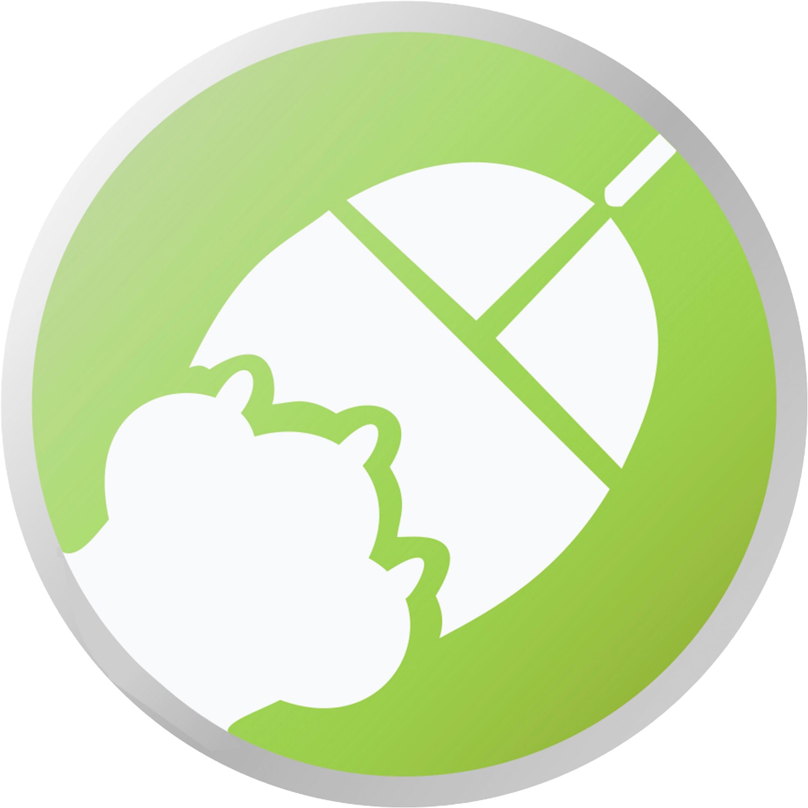

# **Mi experiencia UX**

Antes de cursar la asignatura, nunca me había realmente preocupado por el diseño de una web o aplicación. Mi objetivo principal al desarrollar algo siempre era que cada botón realizase lo que debía o simplemente que las letras se leyesen bien (contraste fondo blanco y letras negras, por ejemplo). Sin embargo, gracias a las distintas actividades tanto de teoría como de prácticas, he conseguido entender que detrás del desarrollo de una aplicación hay muchas más cosas que simplemente las funcionalidades.

## **TEORÍA**

En las clases de teoría, hemos realizado varias actividades que nos han permitido aplicar lo aprendido en clase en páginas web ya creadas o pensando nuestros propios diseños desde 0 como en la actividad 3.

### **Actividad 1: Etnografía**

En esta actividad, tuvimos nuestra primera toma de contacto con la asignatura y con investigaciones de este estilo. En general, estoy contento con cómo realicé dicha actividad ya que utilicé una situación que le ocurría a muchas personas con las que convivo. Me sirvió para darme cuenta de que a la hora de pensar en una interfaz, tenemos que darle a los usuarios todo en bandeja ya que no debemos suponer que van a saber cómo utilizar nuestro software. Es por ello que la observación es algo muy importante. Por ejemplo, en Sistemas de Información Basados en Web, teníamos que permitir que un tipo de usuario modificase ciertos datos. Para ver qué podía mejorar del diseño, le dije a un amigo si sabría como cambiar el nombre de un producto para ver las dificultades que tendría. Eso me permitió observar que tardaba mucho en encontrar el botón de editar por lo que lo cambié y lo puse más claro.

### **Actividad 2: Análisis página web**

En la segunda actividad, realizada en clase junto a otro compañero, tuvimos que analizar un sitio web asignado por el profesor. De esta forma, nos permitió observar el layout que tenía el sitio web, es decir, la forma en la que está organizada la página. Aprendimos sobre los términos navegación primaria y navegación secundaria y analizamos si la web era simétrica, si sus contenidos estaban centrados, etc. Esto lo pudimos aplicar en prácticas a la hora de realizar la landing page ya que tratamos de organizar la página de forma sencilla sin sobrecargar visualmente alguna parte. 

### **Actividad 3: Moodboard**

Esta actividad fue la que más me gustó junto con la de accesibilidad. En un grupo de 4, realizamos una Moodboard en la app Milanote acerca de una ruta por los peores bares de Granada que denominamos Disaster Bars. Siguiendo la task list propuesta, buscamos una combinación de colores que se adecuara a la idea, siguiendo un esquema de color análogo predominando tonos amarillos, naranjas y marrones, similares a la cerveza y representando la suciedad y un poco el desastre con el marrón. Personalmente creo que dimos en el clavo con los colores y con la idea que queríamos transmitir.
En prácticas, aplicamos esta idea del Moodboard para pensar en los colores de nuestra propuesta de valor, tipografía, iconos, ... Las tablas de inspiración pienso que nos permiten desde un primer momento definir el diseño con el que queremos trabajar para que posteriormente no nos entren dudas y no se pierda tiempo a la hora de buscar colores por ejemplo. Aparte, en la asignatura de web mencionada en la actividad 1, apliqué algunas ideas de las tablas de inspiración, por ejemplo los colores. Realicé una web de venta de productos de animales por lo que, al ser una tienda exclusivamente online idee un logo que mezclase ambas ideas. 

Además, utilice una variedad de colores igual que en la actividad realizada, siguiendo un esquema de colores análogo predominando los tonos verdes y azules. Es por ello que pienso que esta actividad es la que me ha resultado más útil ya que me permite desde un primer momento tener claro el diseño principal del software a desarrollar.

### **Actividad 4: Usabilidad**

En esta actividad, tuvimos que realizar un análisis de usabilidad de 3 páginas web de universidades utilizando como herramienta de apoyo UX Check. Pudimos ver la importancia de hacer que se acceda fácilmente a todos los recursos de una página web además de evaluar algunas de las webs de universidades que utilizan miles de estudiantes durante el curso. Con esto pude darme cuenta, de que dichas webs que deberían ser fáciles de navegar y utilizar, no cumplían este objetivo produciendo en el usuario que las utiliza una mala experiencia. Aprendí que aunque como hemos mencionado anteriormente, el diseño es importante, la funcionabilidad de la web, lo es mucho más ya que una web es una herramienta que da solución a muchos de los problemas de los usuarios. Ver como en unas webs era tan fácil acceder al menú del comedor o encontrar el calendario oficial mientras que en otras parecen que lo esconden da que pensar. Por ello, hay veces que para algunas webs o apps, no hace tanta falta tener un diseño bonito, sino que funcionen bien y sea fácil de utilizar y dar respuesta a las preguntas de los usuarios. 

### **Actividad 5: Accesibilidad**
El último ejercicio que realizamos fue  estudio de accesibilidad en mi caso de la página web del ayuntamiento de Jerez de la frontera (Cádiz). Esta fue la segunda actividad que más me gustó ya que no conocía este tipo de extensiones y me ayudó a entender que es importante hacer tu software accesible ya que no sabes realmente quién puede usarlo por lo que hay que trabajar la accesibilidad desde el principio. Es por ello que lo principal que aprendí con esta actividad, es que debemos de, aparte de hacer accesible a todo el mundo la web (permitiendo que se pueda leer los contenidos de la pantalla con ChromeVox por ejemplo), orientar y hacer la web más accesible o menos dependiendo nuestro público objetivo. Por ejemplo, en Jerez hay mucha población anciana por lo que la web tiene iconos grandes para guiarlos en su proceso de búsqueda de información. Aquí vemos además, la importancia de tener un layout correcto, con suficiente separación como vimos en la actividad 2. 
 
 
 
## **PRÁCTICAS**
Las prácticas las voy a evaluar en conjunto ya que creo que al haber sido un proceso incremental en el que a medida que avanzábamos en ellas, íbamos aprendiendo más y más sobre UI/UX. Al principio, estuvimos un poco perdidos ya que no acabábamos de comprender realmente el objetivo de todo lo que teníamos que realizar. Poco a poco, nos fuimos dando cuenta de que todo lo que estábamos realizando, el análisis de competencia, personas, mapas de experiencia de usuario... nos estaba sirviendo para ver lo que le faltaba al hostel para poder crear una propuesta de valor con sentido. Sin usuarios, no hay soluciones porque tampoco hay problemas, así que todo el trabajo posterior sin haber realizado la primera práctica, no habría servido para nada. Lo que más me ha gustado, y donde más he aportado ha sido en el prototipado. Definimos antes los problemas a resolver en el hostel y posteriormente dimos pensamos en una idea para mejorar la propuesta cultural de Carlota Braun. El hecho de realizar antes del prototipo de alta fidelidad, el prototipo de baja fidelidad, la malla receptora de información, canvas, nos permitió facilitar el desarrollo del mockup ya que simplemente teníamos que adaptar el wireframe a lo pensado en el moodboard. Cuando ya tenemos las bases de lo que queremos realizar, diseñar un prototipo de alta fidelidad es mucho más seguro ya que al haber recibido un feedback anteriormente del cliente, sabes que estas realizando correctamente tu trabajo como diseñador. Además, pienso que todo lo realizado hasta la práctica 3 (incluida) es de gran utilidad ya que por lo que he podido leer por Internet de desarrolladores en empresas, hay veces que cuando contratan a alguien, no suele conocer términos como landing page, wireframe, etc. por lo que pienso que al haber tenido que realizar ya un case study en prácticas, he afianzado correctamente dichos conocimientos que, estoy seguro de que en mi futuro profesional, me van a ser muy útiles. Finalmente, en la última práctica, pudimos evaluar prácticas de otros compañeros lo cual me ha servido para aprender cosas que han hecho ellos bien y nosotros un poco peor. También hemos podido ser evaluados por nuestros compañeros, que a veces suelen ser más críticos, sirviéndonos para darnos cuenta de que el proceso de diseño no se acaba aquí y que podemos seguir avanzando con lo ya creado para mejorar la aplicación hasta que le guste a la mayoría de personas. 

